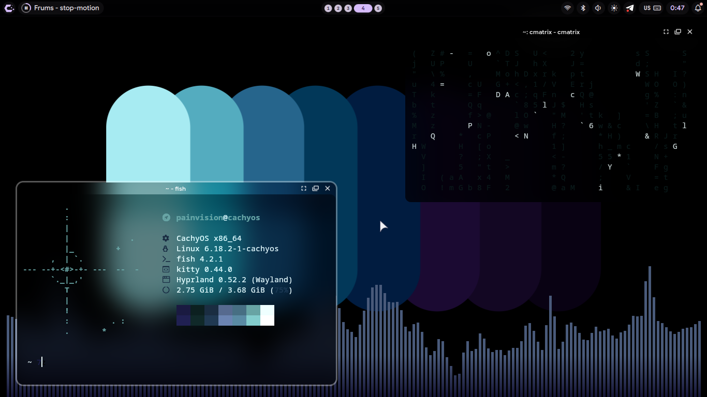

# 🏙️ 𝐄𝐜𝐥𝐢𝐩𝐬𝐞 𝐃𝐨𝐭𝐟𝐢𝐥𝐞𝐬 <sub>[𝐤𝐞𝐲𝐛𝐢𝐧𝐝𝐬 ](https://github.com/pabcihba/EclipseDots/blob/main/keybinds.md) | [𝐟𝐞𝐚𝐭𝐮𝐫𝐞𝐬](https://github.com/pabcihba/EclipseDots/blob/main/features.md)</sub>
###### 🇷🇺 [комбинации клавиш](https://github.com/pabcihba/EclipseDots/blob/main/keybinds_ru.md) | [основные функции](https://github.com/pabcihba/EclipseDots/blob/main/features_ru.md)


# 𝐈𝐧𝐬𝐭𝐚𝐥𝐥𝐚𝐭𝐢𝐨𝐧 𝐬𝐜𝐫𝐢𝐩𝐭

> [!CAUTION]
> That project was made as a hobby, which means there WILL be bugs and errors in YOUR installation. Be patient and [open an issue](https://github.com/pabcihba/EclipseDots/issues/new/choose) or contact me on [Telegram](https://t.me/NextTimeUsername)

> [!IMPORTANT]
> Currently supporting Arch based distros. This script isn't well tested and may cause issues. Always check scripts you download online.

```
curl -L https://raw.githubusercontent.com/painvision/EclipseDots/main/install_arch.sh > install_eclipse.sh; sudo chmod +x install_eclipse.sh; ./install_eclipse.sh
```
